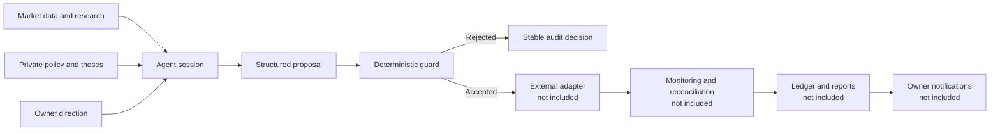

# Make Your CodeX Earn Token

[](https://github.com/dukewillbe185/codex_earn_token/actions/workflows/ci.yml)
[](https://github.com/dukewillbe185/codex_earn_token/actions/workflows/release-smoke.yml)
[](LICENSE)


**A public reference architecture for an auditable, LLM-managed paper-trading system with
deterministic enforcement, hard safety boundaries, and owner-gated evolution.**

[Overview](#overview) · [Architecture](#architecture) · [Operating model](#operating-model) · [Evolution](#proactive-owner-gated-evolution) · [Guardrails](#guardrail-principles) · [Owner interfaces](#owner-interfaces) · [Quick start](#quick-start) · [Security](#security-and-secrets)

> [!IMPORTANT]
> This repository is a sanitized, network-free architecture preview. It cannot place orders and
> does not include the operating strategy, production integrations, infrastructure, or runtime
> records. The private deployment currently uses paper trading. This is experimental research
> software, not investment advice, and it does not promise a profit.

## Overview

The full project treats Codex as a portfolio manager while keeping irreversible actions behind a
deterministic control boundary. The agent can research, compare candidates, write theses, and
propose decisions. It cannot bypass the guardrail layer or directly write to a broker.

The design deliberately separates judgment from enforcement:

- The agent produces structured proposals with an explicit rationale and invalidation condition.
- Deterministic code validates every proposal against an owner-controlled safety envelope.
- External adapters, monitoring, reconciliation, and bookkeeping remain outside the reasoning loop.
- Rejections and accepted decisions produce stable records for review and calibration.
- Changes to owner-controlled risk or infrastructure require explicit owner approval.

This public repository demonstrates that boundary with fictional values and a pure Python
reference implementation. The operating system, strategy, data, and integrations remain private.

## Architecture



No conversational path bypasses the guard. Whether a proposal originates in a scheduled session or
an owner conversation, it must enter the same validation boundary before any external action can
occur.

## Operating model

The private operating loop follows a simple sequence without publishing its schedule, portfolio
policy, or deployment details:

1. Research fresh market information and compare candidates.
2. Write a thesis before proposing a new position.
3. Produce a structured, reviewable decision.
4. Validate the decision through deterministic guardrails.
5. Execute only approved actions through a private adapter.
6. Monitor, reconcile, report, and learn from the outcome.

Execution, monitoring, reconciliation, and bookkeeping are deterministic processes. The LLM is
responsible for judgment and explanation, not for bypassing controls.

## Proactive, owner-gated evolution

The agent is expected to identify what is slowing down learning, reliability, or performance. When
the bottleneck falls outside its authority, it turns the diagnosis into a concrete owner request.

**Observe → Diagnose → Record → Ask → Owner approval → Implement → Measure**

This is proactive evolution, not self-authorized control-plane mutation:

- The agent may improve research methods and propose policy changes.
- Resource requests explain what is needed, why it matters, and the priority.
- Owner-controlled risk settings, execution code, credentials, and infrastructure are never changed
  without explicit approval.
- Later sessions measure whether an approved change improved the intended outcome.

The private system can deliver these requests through an owner-facing messaging channel. The real
messages, portfolio measurements, and strategy screenshots are not part of this public repository.

## Guardrail principles

The production limits and portfolio rules are private. The public example demonstrates the design
principles without publishing operational thresholds:

| Principle | Public contract |
|---|---|
| Deterministic boundary | Reasoning proposes; deterministic code disposes |
| Paper-only example | The included function rejects non-paper mode |
| No direct writes | The reference package has no broker or network integration |
| Direction control | Unsupported sides are rejected explicitly |
| Size control | Fictional order limits are checked before acceptance |
| Buying-power control | Proposals cannot exceed the fictional account snapshot |
| Stable rejection | Every denied proposal returns a machine-readable reason |
| Immutable inputs | Proposals, snapshots, envelopes, and decisions are frozen records |

The example values in [`examples/risk.example.toml`](examples/risk.example.toml) are fictional and
unrelated to any operating configuration.

## What is included

- Immutable fictional order, account, envelope, and decision contracts.
- A pure `evaluate_order` function with illustrative paper-only checks.
- Fake-data tests for acceptance and rejection paths.
- A non-operational example configuration.
- CI, release smoke checks, and a responsible disclosure policy.
- Documentation of the public safety architecture.

## What remains private

- Trading strategies, theses, allocations, targets, schedules, and policy memory.
- Real risk limits and owner-controlled configuration.
- Broker, Telegram, notification, and deployment implementations.
- Candidate boards, decisions, orders, fills, audit logs, reports, and account data.
- Credentials, server details, local paths, and owner-specific information.

## Owner interfaces

The private deployment can expose three owner-facing capabilities without making them part of the
public package:

- **Messaging:** owner conversations, status requests, and approval-gated change requests.
- **Notifications:** fills, risk events, operational failures, and settlement summaries.
- **Dashboard:** a local-only view of positions, risk headroom, progress, and system usage.

The current private deployment uses Telegram and optional ntfy notifications. Tokens, chat
identifiers, commands, authorization behavior, ports, and deployment instructions are intentionally
not published here.

## Quick start

Requirements: Python 3.10+ and [uv](https://docs.astral.sh/uv/).

```bash
git clone https://github.com/dukewillbe185/codex_earn_token.git
cd codex_earn_token
uv sync --locked --dev
make check
```

Example:

```python
from codex_earn_token import (
    AccountSnapshot,
    OrderProposal,
    SafetyEnvelope,
    evaluate_order,
)

decision = evaluate_order(
    OrderProposal(symbol="DEMO", side="buy", notional=5.0),
    AccountSnapshot(equity=100.0, buying_power=80.0),
    SafetyEnvelope(paper_only=True, allow_short=False, max_order_fraction=0.10),
    mode="paper",
)

assert decision.allowed
```

All values above are fictional examples. They are unrelated to any operating configuration.

## Public repository map

| Path | Purpose |
|---|---|
| `src/codex_earn_token/contracts.py` | Immutable fictional input and output contracts |
| `src/codex_earn_token/guardrails.py` | Pure, deterministic reference validation |
| `examples/risk.example.toml` | Non-operational example envelope |
| `tests/` | Fake-data acceptance and rejection tests |
| `.github/workflows/` | CI and release smoke verification |
| `SECURITY.md` | Responsible disclosure guidance |

## Security and secrets

This repository contains no production credentials or runtime data. Real credentials belong only
in environment variables or a dedicated secret store and must never be committed to source,
reports, issues, or logs.

The public example follows three rules:

1. Secrets and operational data never belong in source control.
2. External side effects stay behind a deterministic, testable boundary.
3. A rejected action returns a stable, auditable reason.

See [SECURITY.md](SECURITY.md) for responsible disclosure guidance.

## License

The files in this public preview are available under the [MIT License](LICENSE). Private operational
code, strategies, integrations, and data are not part of this distribution.
