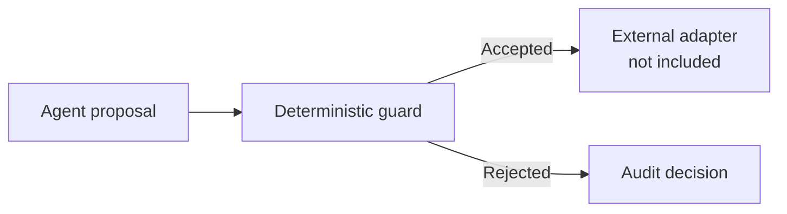

# Make Your Codex Earn Token

[](https://github.com/dukewillbe185/codex_earn_token/actions/workflows/ci.yml)
[](https://github.com/dukewillbe185/codex_earn_token/actions/workflows/release-smoke.yml)


A safety-first reference architecture for separating an agent's proposals from deterministic
enforcement.

> This repository is a deliberately sanitized public preview. It is not the operating trading
> system and cannot place orders. Strategies, production configuration, execution adapters,
> infrastructure, and operational records are intentionally private.

## Why this exists

Autonomous systems need a hard boundary between probabilistic reasoning and irreversible actions.
This preview demonstrates the smallest useful version of that boundary: immutable input contracts
and a deterministic, network-free guard function.



The reference function never contacts a broker, reads credentials, or performs network I/O.

## Included

- Immutable fictional order, account, envelope, and decision contracts.
- A pure `evaluate_order` function with illustrative paper-only checks.
- Fake-data tests for acceptance and rejection paths.
- A non-operational example configuration.
- CI, release smoke checks, and a minimal security policy.

## Intentionally private

- Operational strategies, policies, and configuration.
- Production integrations and infrastructure.
- Runtime records, credentials, and owner-specific data.

## Quick start

Requirements: Python 3.10+ and [uv](https://docs.astral.sh/uv/).

```bash
uv sync --locked --dev
make check
```

Example:

```python
from codex_earn_token import (
    AccountSnapshot,
    OrderProposal,
    SafetyEnvelope,
    evaluate_order,
)

decision = evaluate_order(
    OrderProposal(symbol="DEMO", side="buy", notional=5.0),
    AccountSnapshot(equity=100.0, buying_power=80.0),
    SafetyEnvelope(paper_only=True, allow_short=False, max_order_fraction=0.10),
    mode="paper",
)

assert decision.allowed
```

All values above are fictional examples. They are unrelated to any operating configuration.

## Security model

The public example illustrates three principles:

1. Reasoning proposes; deterministic code disposes.
2. A rejected action returns a stable, auditable reason.
3. Secrets and operational data never belong in source control.

See [SECURITY.md](SECURITY.md) for responsible disclosure guidance.

## License

The files in this public preview are released under the MIT License. Private operational code and
data are not part of this distribution.
